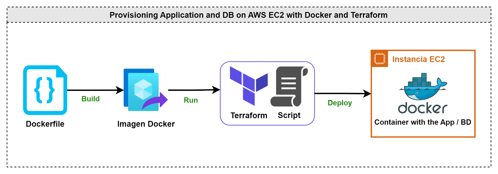
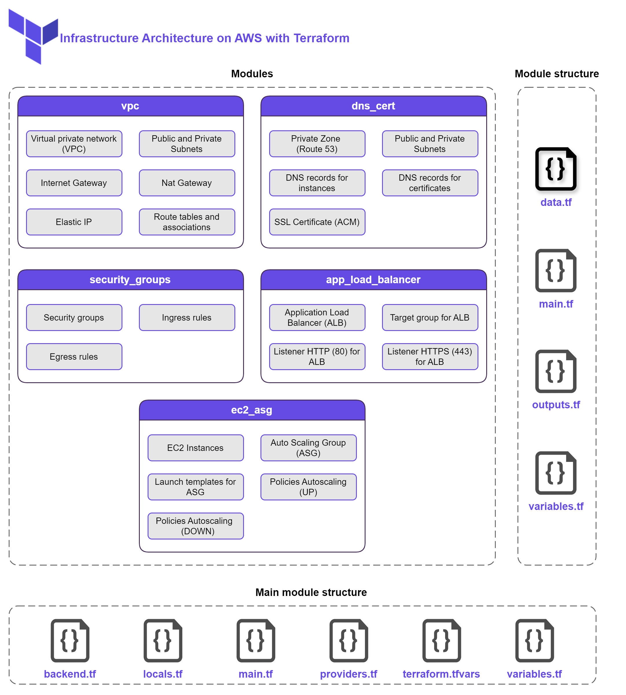
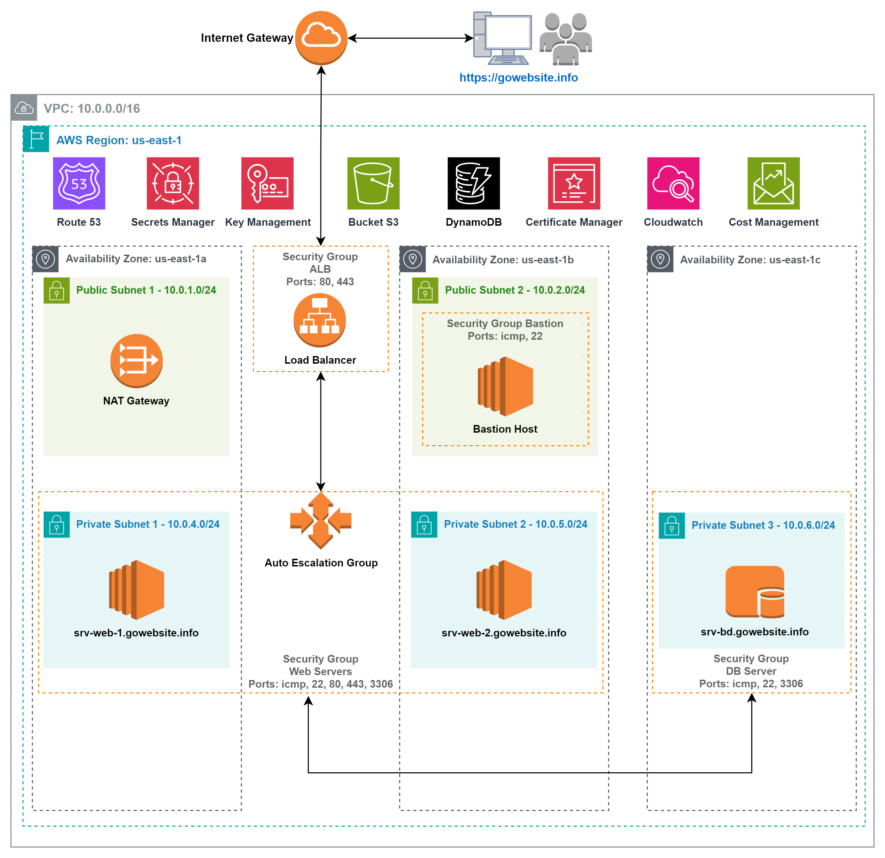

# devops-project-01
Implementing CI/CD pipeline using Azure DevOps and deploying Infrastructure on AWS

## Diagrams

### Diagram 1: Containerization and deployment

### Diagram 2: Infrastructure Architecture on AWS with Terraform

### Diagram 3: CI/CD Pipelines

### Diagram 4: Cloud Architecture on AWS
